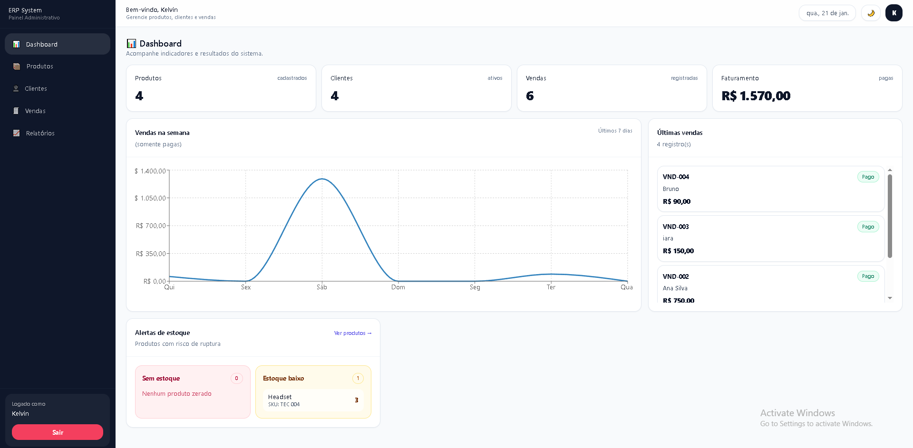
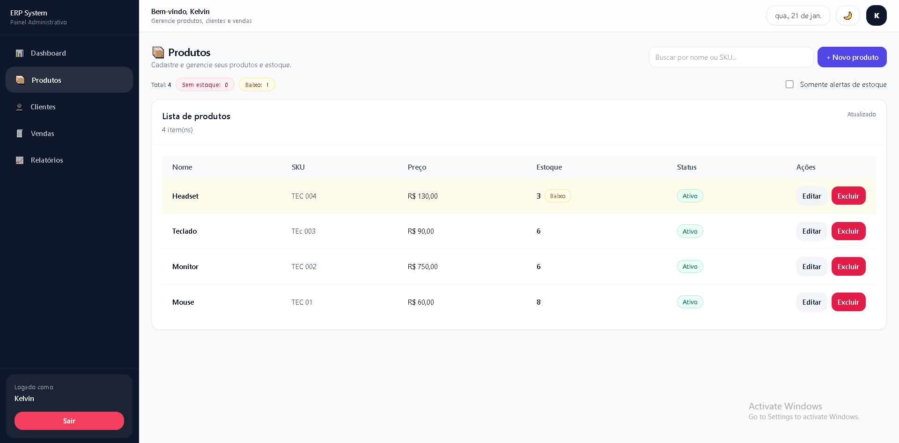
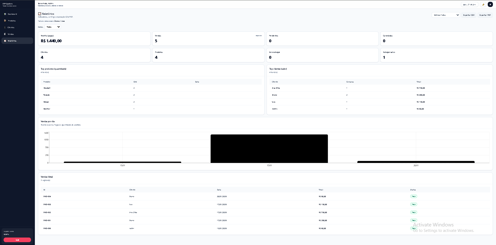

# 🧩 ERP Front-end — Sistema de Gestão Comercial (MVP)


> **ERP (Enterprise Resource Planning) – MVP Front-end**  
> Aplicação construída em **React + TypeScript**, com foco em UX corporativa, módulos essenciais e regras reais de negócio (produtos, clientes, vendas, estoque e relatórios).  
> Estrutura preparada para evoluir para integração com **API real** sem refatoração pesada.

---

## 🌍 Demo (Vercel)
🔗 (https://erp-system-livid.vercel.app/)

---

## 🎥 Preview (GIF)
> **Dica:** grave um GIF do sistema usando ScreenToGif (Windows) e salve em:
`public/screenshots/preview.gif`

Exemplo:


---

## 📸 Screenshots

### Dashboard


### Produtos


### Relatórios


---

## 🔐 Credenciais (ambiente local)
Se o login estiver mockado:

- **Usuário:** kelvin  
- **Senha:** 123

---

## ✅ Features (Visão geral)

| Módulo | Recursos |
|------|----------|
| **Auth** | Login/Logout, sessão persistente, rotas protegidas |
| **Dashboard** | Indicadores reais, gráfico, últimos registros |
| **Produtos** | CRUD + validação, busca, status e estoque |
| **Clientes** | CRUD, busca e lista |
| **Vendas** | Criação, status, baixa/estorno de estoque |
| **Relatórios** | Filtros por período + exportação CSV/PDF |
| **UX** | Componentes base, badges, cards, toasts |

---

# 📌 Regras de Negócio (Business Rules)

### 📦 Produtos / Estoque
- Produtos possuem:
  - `name`, `sku`, `price`, `stock`, `status`
- Validações:
  - SKU único
  - Estoque não pode ser negativo
  - Produto inativo não pode ser vendido

### 🧾 Vendas
- Uma venda possui:
  - itens (produto + quantidade)
  - cliente
  - valor total
  - status (`Rascunho | Confirmada | Paga | Cancelada`)

### ✅ Baixa de estoque
- Ao confirmar/pagar uma venda:
  - reduz estoque automaticamente
- Ao cancelar/deletar venda:
  - estorna estoque automaticamente

### 🧠 Dashboard / Métricas
- **Faturamento** considera **somente vendas com status "Pago"**
- Últimos 7 dias exibidos no gráfico
- Lista de últimas vendas ordenadas por data

---

# 🧪 Mock API (LocalStorage)

O projeto simula um backend real com uma camada de `services/` (API Fake).
Isso permite desenvolver o front como se estivesse consumindo endpoints reais.

### Exemplo de “endpoints”
| Método | Endpoint | Descrição |
|-------|----------|----------|
| GET | `/products` | lista produtos |
| POST | `/products` | cria produto |
| PUT | `/products/:id` | edita produto |
| DELETE | `/products/:id` | remove produto |
| GET | `/customers` | lista clientes |
| POST | `/orders` | cria venda |
| PATCH | `/orders/:id/status` | altera status |
| GET | `/reports` | relatório por período |

> A troca para backend real no futuro é simples:  
> basta substituir os services por Axios/fetch mantendo a mesma interface.

---

# 🏗️ Arquitetura

O projeto foi pensado com divisão clara por responsabilidade:

✅ `pages/` → telas do ERP  
✅ `services/` → camada de dados/API (fake)  
✅ `store/` → auth + estado global (Zustand)  
✅ `ui/` → componentes reutilizáveis (Button/Card/Badge/Toast)  
✅ `routes/` → roteamento e proteção

---

# 🛠️ Tecnologias

- **React + TypeScript**
- **Vite**
- **React Router DOM**
- **TanStack React Query**
- **Zustand** (Auth/Session)
- **React Hook Form + Zod** (Forms + Validação)
- **Tailwind CSS**
- **ESLint** (Padrões de qualidade)
- Exportação PDF (html2canvas / jsPDF)

---

📁 Estrutura do projeto
src/
 ├─ app/
 │  ├─ layouts/
 │  ├─ routes/
 ├─ pages/              # telas do sistema
 ├─ services/           # "API" fake / localStorage
 ├─ store/              # Zustand (auth, etc.)
 ├─ ui/                 # componentes base
 ├─ features/           # schemas/regras por domínio
 ├─ index.css
 ├─ main.tsx
 └─ App.tsx

## ⚙️ Como rodar localmente

### 1) Clonar o repositório
```bash
git clone https://github.com/kelvin-dev23/erp-system.git
cd erp-frontend
 ```
2) Instalar dependências:

npm install

3) Rodar em desenvolvimento:

npm run dev

Acesse:
➡️ http://localhost:5173

✅ Qualidade / QA

Lint:
git 
npm run lint

Build:

npm run build

Preview do build:

npm run preview

☁️ Deploy (Vercel)

Framework Preset: Vite
Build Command: npm run build
Output Directory: dist

Se o Vercel pedir a pasta do projeto:

Root Directory: erp-frontend

👤 Autor

Desenvolvido por Kelvin Augusto 🚀
📌 Front-end Developer

GitHub: https://github.com/kelvin-dev23

LinkedIn: https://www.linkedin.com/in/kelvin-augusto-dev
